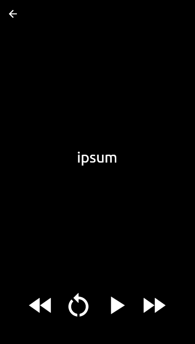

# Leitor Ágil

Aplicativo Flutter para ajudar a ler arquivos e documentos rapidamente  
exemplo de como funciona: https://www.youtube.com/watch?v=wZhbyMjL4oQ  

## Capturas

## Dependências
* [provider](https://pub.dev/packages/provider)
* [file picker](https://pub.dev/packages/file_picker)
* [flutter spinbox](https://pub.dev/packages/flutter_spinbox)
* [flutter colorpicker](https://pub.dev/packages/flutter_colorpicker)
* [syncfusion flutter pdf](https://pub.dev/packages/syncfusion_flutter_pdf)